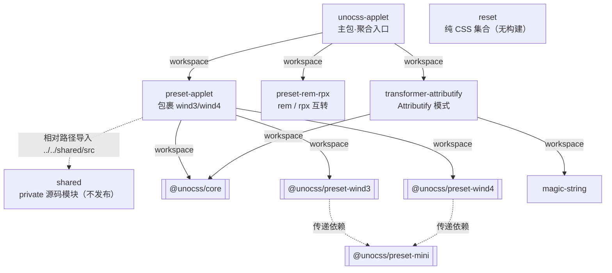

# 贡献指南

感谢你对 unocss-applet 的兴趣！本文档介绍项目架构与开发流程，帮助你快速参与贡献。

## 贡献指南

unocss-applet 让 [UnoCSS](https://github.com/unocss/unocss) 能在 uni-app、Taro 构建的小程序中运行，兼容小程序不支持的语法（`~`、`/`、`:()` 等选择器字符，以及 `space-x-*`、`divide-*` 等依赖后代/伪元素的工具类）。它**不是** UnoCSS 的 fork，而是通过包裹上游 `@unocss/preset-wind3` / `@unocss/preset-wind4` 并注入转换器来工作。

### 环境要求

| 依赖 | 版本 |
| --- | --- |
| Node | 22（见 `.nvmrc`） |
| pnpm | 10.34.4（见 `package.json` 的 `packageManager`） |

建议启用 [corepack](https://nodejs.org/api/corepack.html) 自动切换 pnpm 版本：`corepack enable`。

### 技术栈

- **Monorepo**：pnpm workspace + [catalog](https://pnpm.io/catalogs) 集中管理依赖版本（`pnpm-workspace.yaml`）
- **构建**：[unbuild](https://github.com/unjs/unbuild)
- **测试**：[vitest](https://vitest.dev/)（快照位于 `test/assets/output/`、`test/fixtures/output/`）
- **Lint**：[@antfu/eslint-config](https://github.com/antfu/eslint-config)
- **示例**：uni-app（Vue3 + Vite）、Taro 3 / Taro 4（React + Webpack5）

### 目录结构

```
.
├── packages/                # 发布的包
│   ├── unocss-applet/       # 主包，聚合入口
│   ├── preset-applet/       # 默认预设，包裹 wind3/wind4
│   ├── preset-rem-rpx/      # rem <-> rpx 互转
│   ├── transformer-attributify/  # 小程序 Attributify 模式
│   ├── shared/              # private，源码级内部模块（不发布）
│   └── reset/               # 纯 CSS reset 集合（无构建）
├── examples/                # 集成示例
│   ├── uni-app/             # uni-app + Vue3 + Vite
│   ├── taro3/               # Taro 3.6 + React + Webpack5
│   └── taro4/               # Taro 4.2 + React + Webpack5
├── test/                    # 单元测试与快照
├── pnpm-workspace.yaml      # workspace 与 catalog 定义
└── package.json
```

### 架构图

下图展示包之间的依赖关系。实线为 `workspace:*` 包依赖，虚线为源码内相对路径导入（不产生包依赖）。



**关键点：**

- `unocss-applet` 是聚合入口，对外暴露 `presetApplet`、`presetRemRpx`、`transformerAttributify`。
- `preset-applet` 通过调用上游 `presetWind3` / `presetWind4`、删除末尾 `questionMark` 规则、替换 `variantSpaceAndDivide` 变体，并注入小程序专用的 `postprocess`（编码选择器非法字符）来工作。
- `shared` 是 `private` 包，仅通过相对路径被 `preset-applet` 引用，不发布到 npm。
- `reset` 是纯静态 CSS，直接发布 `taro/` 和 `uni-app/` 目录，无构建步骤。

### 各包职责

| 包 | 职责 |
| --- | --- |
| `unocss-applet` | 主包，聚合并重新导出 preset 与 transformer。 |
| `preset-applet` | 默认预设。包裹 `@unocss/preset-wind3`/`wind4`，移除小程序不兼容的规则与变体，注入选择器编码 postprocess。支持 `preset: 'wind3' \| 'wind4'`。 |
| `preset-rem-rpx` | 在 `rem2rpx`（小程序端）与 `rpx2rem`（H5 端）间转换，使同一份样式适配两端。 |
| `transformer-attributify` | 为小程序启用 Attributify 模式（把 `text="red"` 转成 `class="text-red"`），因为小程序不支持属性选择器生成的写法。 |
| `reset` | CSS reset 集合（tailwind、normalize、sanitize 等），每个文件含 uni-app / Taro 条件编译注释，区分 H5 与小程序端规则。 |

> preset / transformer 与上游 UnoCSS 的兼容关系、不支持项及变通方案详见 [`COMPATIBILITY.md`](./COMPATIBILITY.md)。

### 开发流程

```bash
# 1. 安装依赖
pnpm install

# 2. 开发模式（生成 stub，源码改动实时生效，无需重新构建）
pnpm dev

# 3. 构建所有包
pnpm build

# 4. 类型检查
pnpm typecheck

# 5. Lint（自动修复）
pnpm lint:fix

# 6. 测试（watch 模式）
pnpm test
# 更新快照
pnpm test:update
```

#### 调试示例

修改 preset/transformer 后，可在真实集成环境验证：

```bash
# uni-app
pnpm play:uni:mp-weixin   # 小程序
pnpm play:uni:h5           # H5

# Taro 3
pnpm play:taro3:weapp
pnpm play:taro3:h5

# Taro 4
pnpm play:taro4:weapp
pnpm play:taro4:h5
```

> 小程序端编译依赖原生工具链与平台插件，真机预览需在微信开发者工具中完成。

### 贡献规范

#### Commit message

遵循 [Conventional Commits](https://www.conventionalcommits.org/)：

```
feat(preset-applet): support wind4 property preflight
fix(reset): wrap form rules with ifdef H5
docs: add architecture diagram to CONTRIBUTING
chore(deps): bump unocss to 66.7
```

类型前缀：`feat`、`fix`、`docs`、`style`、`refactor`、`perf`、`test`、`chore`、`ci`。

#### PR 流程

1. Fork 仓库并从 `main` 切出特性分支。
2. 确保 `pnpm typecheck`、`pnpm lint`、`pnpm test` 全部通过。
3. 若改动影响生成 CSS，用 `pnpm test:update` 更新快照，并在 PR 描述中说明 diff 的合理性。
4. 关联相关 issue。

#### 添加测试

测试位于 `test/`，快照位于 `test/assets/output/`（CSS）与 `test/fixtures/output/`（Vue 文件）。新增工具类或修复 bug 时：

- 新增的工具类目标可加入 `test/assets/preset-wind3-targets.ts` / `preset-wind4-targets.ts`。
- 运行 `pnpm test:update` 生成快照，核对 diff 确认符合预期。
- `unmatched` 列表（wind4 测试中的 inline snapshot）记录已知无法生成的目标，变更时同步更新。

### 关于 reset 的同步

`@unocss-applet/reset` 为**手工同步**，无自动脚本：

- `tailwind.css` 上游对应 UnoCSS 内置的 Tailwind preflight，需定期对照 `@unocss/reset/tailwind.css` 同步。
- `normalize.css`、`modern-normalize.css`、`sanitize.css`、`eric-meyer.css`、`button-after.css` 是各自独立项目的快照，与 UnoCSS 版本无关。
- 同步时注意：表单/浏览器兼容规则（`-webkit-appearance`、`::-webkit-*`、`:-moz-*`、`[type='search']` 等）只在 H5 端有效，必须放在 `#ifdef H5`（uni-app）/ `#ifdef  h5`（Taro）块内；`[hidden]`、`--un-content` 变量等双端通用规则放在条件编译外。

### 发布流程

发布由维护者通过 [bumpp](https://github.com/antfu/bumpp) 完成：

```bash
pnpm release
```

这会交互式升版本号、打 tag、推送，随后由 CI（GitHub Actions）完成发布。贡献者无需关心发布。
